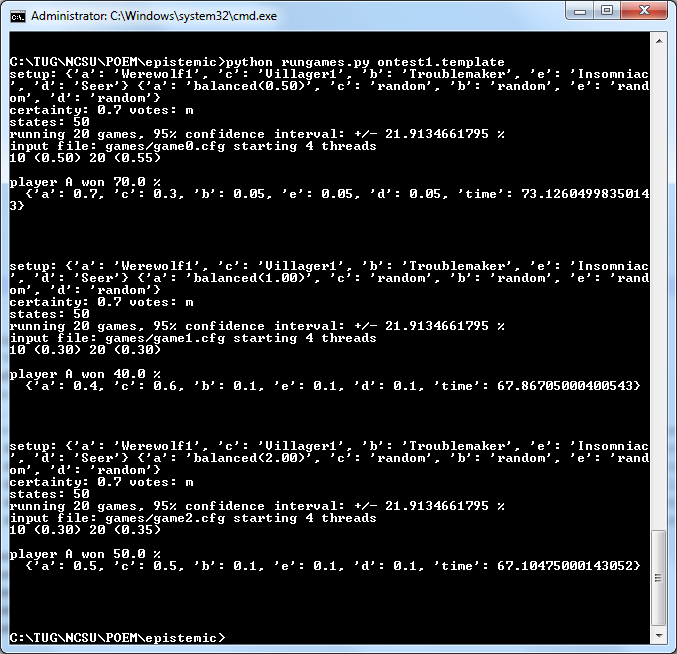

One Night Ultimate Werewolf Simulation
======================================

This repository contains the code, input files and output files we present in our paper [Keeping the Story Straight: A Comparison of Commitment Strategies for a Social Deduction Game](papers/aiide2018.pdf).

Requirements and Installation
-----------------------------

* Python 2.7

* GHC >= 7.6.3

* Haskell Packages:
   + array
   + DiffArray
   + MonadRandom
   + random
   + transformers
   + Parsec
   + parsec-numbers
   + docopt
   + mtl
   + text
   + split
   + parallel

We recommend using [Haskell Platform](https://www.haskell.org/platform/) and installing the required packages with cabal (e.g. ```cabal install mtl```). Compile with ```ghc --make -rtsopts rungameA.hs```. We also provide a Makefile that runs exactly that command when you run ```make```. Tested on Windows only. For Unix-like operating systems, you will have to convert usage.txt to Unix line-endings (e.g. with dos2unix).

Usage
------------

### General usage

There are three components that comprise our system:
  - ```rungameA``` runs single Ostari input files, in our case single One Night Ultimate Werewolf games, including the agents' decisions in the game
  - ```rungames.py``` uses a template for an Ostari input file, populates it with values, runs many instances of ```rungameA```, and checks the output
  - ```httpserver.py``` provides a web-based interface to run a single Ostari input file. This can be used to play e.g. One Night Ultimate Werewolf in a web browser for verification purposes
  
To see a single game of One Night Ultimate Werewolf in action, simply run
```./rungameA onuw.cfg```
One example output for a run of this game can be found in ```output/onuw.log```.
  
For the results obtained in our paper, we used rungames.py with different settings, to have it vary the commitment levels, role assignments, required certainty that agents need to have to follow particular goals, number of 
states expanded, etc. In the next section we will explain how to reproduce the different experiment results we report in our paper.

### Command line usage

To run the experiments in our paper we used ```rungames.py```, which is a very versatile utility that can be used to run a number of different experiment setups. The basic idea is that the setup for a game is
passed to ```rungames.py```, and it will start a large number of processes to estimate the win rate for a particular player (by convention always player A) up to the desired margin of error. For our paper we used 
4000 games for most experiments, which results in a margin of error of +/- 1.5%. *Before you run the experiments* note that the resource requirements in terms of processing time and memory usage are significant:
Each process will use around 2GiB of RAM, and sometimes more, depending on the exact settings. Furthermore, each game will take between 1 and 5 minutes for typical settings, so we recommend running as many games
in parallel as the hardware can handle. Even so, rerunning a single variant from our paper with 10 cores in parallel is expected to take around 20 hours. Because of this high resource requirement, the
default settings for ```rungames.py``` are set to values that reduce the run time significantly at the expense of accuracy.

By default, if you run

```python rungames.py onuw.template```

will run experiments on a single game setup, in which player A is a Werewolf, player B the Rascal, player C an ordinary Villager, player D the Seer and player E the Insomniac. Player A is controlled by a balanced agent,
while all other players are controlled by capricious agents. The script will vary the level of commitment of player A between the values 0.5, 1 and 2 and report the winrate for that player. Note that only 20 games per 
variant are played, which results in a 95% confidence interval of +/- 21.9%, and therefore the exact results are not to be taken as particularly representative. However, even this very limited experiment is likely to run 
for around 20 minutes on contemporary hardware. To assure users that the tool is still running, it will print intermediate results after every 10 games. The expected outcome is something like this:

 

To modify the resource requirements the following command line options can be used:
   - -n sets the number of games to be played for each variation (default: 20)
   - -t sets the number of threads, which corresponds to the number of games that will be run in parallel (default: 4)

The game setup itself can be manipulated by the following command line options:
   - --a-card, --b-card, --c-card, --d-card, --e-card are used to set the role cards for the players. The center cards are assumed to be the remaining 3 cards in no particular order
   - --a-ai, --b-ai, --c-ai, --d-ai, --e-ai are used to set the agent types for the players. Valid values are random, capricious, fanatical and balanced

The main experiments we ran used a constant setup and agent assignment and then varied the behavior of these agents by setting other options. For each of the following command line options it is possible to pass
either a constant value, a comma separated list, or (for numeric values) an expression of the form ```start:end:step```, which is used to generate a list of values. Each combination of argument assignments taken from these
lists is one variation, which is then run according to the other settings, and a separate result is reported. 
   - --commitment is used to set the level of commitment of *all* balanced players
   - --certainty is used to set how suspicious players should be of the world before adopting goals
   - --states is used to set how many states the AI agents should expand at most while performing the planning operation
   - --votes is used to set if a player needs a majority (m) or only a plurality (p) of votes to be eliminated

For example, to reproduce the results from our main experiment (which uses the default role card assignment), one would run

```python rungames.py --commitment 0.2,0.5,0.66,1,1.33 -n 4000 -t 10 --states 100```

In addition to being able to manually set role assignments, agent types and other settings, the tool also provides a -p option that can be used to select one of these presets:
   - ```commitment``` will run balanced agents with different levels of commitment against capricious agents in the game setup used in our main experiment
   - ```commitmentr``` will run balanced agents with different levels of commitment against random agents in the game setup used in our main experiment
   - ```states``` will run balanced agents against capricious agents while varying how many states each of them can expand during the planning process
   - ```lopsided``` will run balanced agents against capricious agents in a game that is heavily biased against player A
   - ```suspicious``` will run balanced agents against capricious agents in a game that is heavily biased against player A, varying the certainty the players need to have to adopt their goals
   
These presets are meant to correspond to the experiments reported in our paper. Any of the command line options described above can be used to override any of the settings, though, making it possible
to run other experiments based on ours.

A set of results from our own experiments can be found in [pdf form in the repository](papers/resulttables.pdf)

### Online version

To play One Night Ultimate Werewolf in a web browser, run
```python httpserver.py onuwweb.cfg```
and then open [127.0.0.1:31337](http://127.0.0.1:31337) in a web browser. Alternatively, you can also use ```rungameA.exe onuwweb.cfg``` to play on the command line. Note
that this will show all output from the system, which will reveal whether agents are lying or not, which is useful for testing.

Acknowledgements
----------------

This material is based upon work supported in whole or in part with funding from the Laboratory for Analytic Sciences (LAS). Any opinions, findings, conclusions, or recommendations expressed in this material are those of the author(s) and do not necessarily reflect the views of the LAS and/or any agency or entity of the United States Government.

